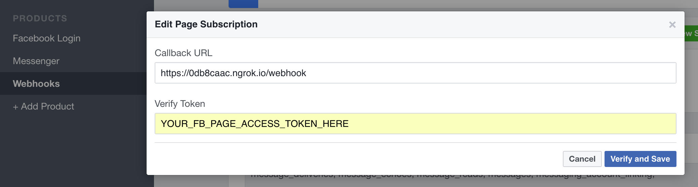
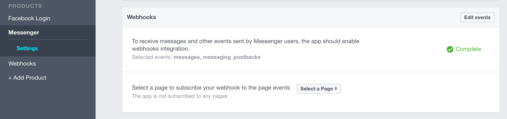
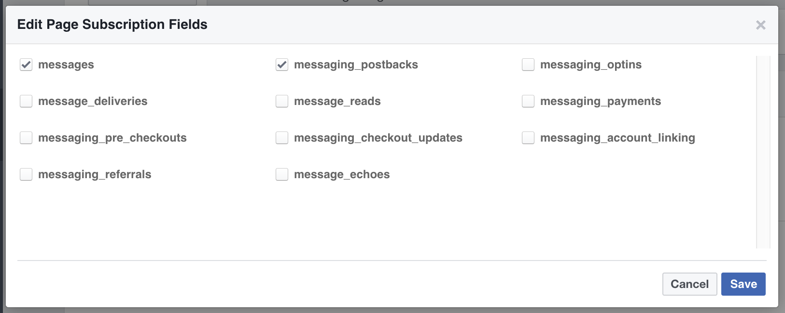

# Facebook Example

A Facebook Messenger Bot Example in Clojure

### Facebook and app setup

1. Setup a Facebook Page, Facebook app, create a Page Access Token and link the app to the page by following this [step-by-step guide](https://github.com/prometheus-ai/fb-messenger-clj/wiki/Facebook-Setup).

2. Download the repository: [lemmings-io/02-facebook-example](https://github.com/lemmings-io/02-facebook-example/archive/master.zip)

3. Extract it into the `/lemmings/clojure/projects` directory.

4. Provide your Facebook Page Access Token, Verify Token and Page Secret for local development by creating a file called `profiles.clj` in your working directory `<your-project-name>/profiles.clj`

		{:dev {:env {:page-access-token "REPLACE"
		   		   	 :verify-token "REPLACE"}}}
		   		   	 
### Starting the development environment

1. Start a new VM shell session via `vagrant ssh` in your terminal.

2. Once logged in to the VM shell change into the facebook-example project directory

		cd 02-facebook-example/

3. Run `ngrok http 3000` ([read more about ngrok](https://ngrok.com))

	

4. Start another new VM shell session via `vagrant ssh` in a new terminal window.

5. Start the local server

		lein ring server

	
	
	Via the [lein-ring doc](https://github.com/weavejester/lein-ring): by default, this command attempts to find a free port, starting at 3000.

### Check if the app is running

1. Visit the https URL of the ngrok process you've started earlier in this guide.  
	E.g. `https://0db8caac.ngrok.io`
	
	If everything went right, you'll see "Hello Lemming :)" in your Browser 🎈
	
	

2. In your Facebook Developer App go to "Webhooks" in the left sidebar and add `Callback URL` and `Verify Token` accordingly:

	

3. Click "Verify and Save" and your app is connected to Facebook's Messenger API. 🎈

	

4. Then go to "Messenger" in the left sidebar and in the section "Webhooks" select your page to subscribe your webhook to the pages events. Subscribe to the events `messages` and `messaging_postbacks`, you can subscribe to more events later.

	
	

5. Go to your Facebook Page and send a message and your bot echo's your input. Congratulations!💧

	
	
Check out the code to find out more. Also try sending "image", "help" or thumbs up to your bot. 🙂

### Deploying to Heroku

1. If you haven't yet, create an account at [Heroku](https://signup.heroku.com/dc).

2. In the VM shell session login to your Heroku account via `heroku login`.

	```
	-> heroku login
	Enter your Heroku credentials.
	Email:
	Password:
	```

3. Create an app on Heroku for your bot. Type `heroku create` into your command prompt at the root of the project.

	```
	-> heroku create
	Creating gentle-plateau-38046... done, stack is cedar-14
	https://gentle-plateau-38046.herokuapp.com/ | https://git.heroku.com/gentle-plateau-38046.git
	Git remote heroku added
	```

4. Do a command line `heroku config` for each one of your tokens:

	```
	heroku config:set PAGE_ACCESS_TOKEN=your_page_access_token
	heroku config:set VERIFY_TOKEN=your_verify_token
	heroku config:set LEIN_BUILD_TASK='ring uberjar'
	```

5. You can deploy to heroku with the following command:

	```shell
	./heroku.sh
	```

	You should see it deploy. 🍵

8. Now we need to setup your app on Facebook with your app hosted on Heroku.

	As you've done it earlier for your local environment, in your Facebook Developer App click on the "Webhooks" section in the left sidebar and add `Callback URL` (e.g. `https://gentle-plateau-38046.herokuapp.com/webhook`) and `Verify Token` accordingly.
	
	

9. Click "Verify and Save" and your Heroku app is connected to Facebook's Messenger API 🎈

	
	
10. Go to your Facebook Page and send a message and your bot should echo your input again. Kudos! 🙂💧

	

Note: This clojure app is ready for deployment on Heroku and based on [Heroku's Clojure Getting Started Example](https://github.com/heroku/clojure-getting-started).

### Links

* [Getting started with GitHub and Git Version Control](https://guides.github.com/activities/hello-world/)
* [JSON Database Example](https://gist.github.com/sido378/0676b4ae6e264a73cc18737aa9496c69)
